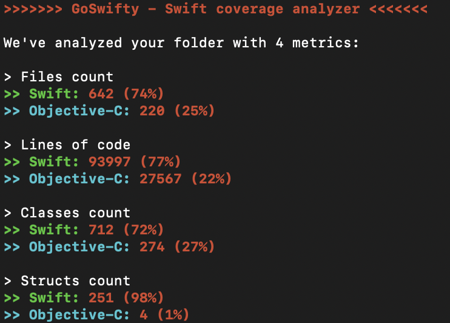

# GoSwifty

<p align="center">
  
</p>

<p align="center">
  <a href="https://twitter.com/rsrbk123">
    
  </a>
  
</p>

<p align="center">
  A command line toolkit for <b>Swift migration tracking</b> and <b>AI/AI-agent readiness</b>.
</p>

<p align="center">
  <a href="#quick-start"></a>
  <a href="#usage"></a>
  <a href="#command-summary"></a>
  <a href="#license"></a>
</p>

---

## Why GoSwifty

GoSwifty started as a migration analyzer for Objective-C to Swift projects.  
It now keeps that original functionality and also adds AI-focused commands so older repositories can evolve into practical AI/agent-friendly codebases.

## At a Glance

| Track | What you get |
|---|---|
| Migration Metrics | Swift vs Objective-C coverage across files, lines, classes, and structs |
| AI Readiness | Repo audit score, engineering signals, keyword signals, and concrete next steps |
| Agent Enablement | Auto-generated `AGENTS.md` starter guide for consistent coding-agent workflows |

## Features

### Core migration analysis (original)

- Swift files count vs Objective-C files count
- Swift lines of code vs Objective-C lines of code
- Swift classes count vs Objective-C classes count
- Swift structs count vs Objective-C structs count

### AI toolkit (new)

- Repository AI/agent readiness audit with scoring and recommendations
- AI keyword signal detection (`agent`, `prompt`, `openai`, `rag`, `mcp`, etc.)
- `AGENTS.md` scaffold generator for coding-agent collaboration

## Quick Start

### Installation

#### Option 1: Mint

```sh
brew install mint
mint install rsrbk/GoSwifty
```

#### Option 2: Build manually

```sh
git clone https://github.com/GoSwifty/goswifty.git
cd goswifty
swift build -c release
```

### One-Minute Run

```sh
swift run GoSwifty analyze .
swift run GoSwifty ai audit . --output AI_READINESS_REPORT.md
swift run GoSwifty ai scaffold . --output AGENTS.md
```

## Usage

### 1) Analyze Swift vs Objective-C migration

```sh
goswifty analyze /Your/Folder/Path
goswifty analyze /Your/Folder/Path /Your/Other/Folder/Path
```

### 2) Audit AI/Agent readiness

```sh
goswifty ai audit /Your/Folder/Path
goswifty ai audit /Your/Folder/Path --output AI_READINESS_REPORT.md
```

### 3) Generate AGENTS.md starter guide

```sh
goswifty ai scaffold /Your/Folder/Path --output AGENTS.md
```

## Example

<p align="center">
  
</p>

## Command Summary

| Command | Description |
|---|---|
| `goswifty analyze <paths...>` | Measure Swift vs Objective-C migration metrics |
| `goswifty ai audit <paths...> [--output file]` | Create an AI readiness report |
| `goswifty ai scaffold <path> [--output file]` | Generate `AGENTS.md` for agent workflows |

## Follow me on Twitter

I promise it's gonna be more interesting stuff there: [@rsrbk123](https://twitter.com/rsrbk123)

## Check out my other libraries

- [SmileToUnlock](https://github.com/rsrbk/SmileToUnlock) - ARKit Face Tracking to detect a smile and unlock the screen.
- [SRCountdownTimer](https://github.com/rsrbk/SRCountdownTimer) - A simple circular countdown with a configurable timer.
- [SRAttractionsMap](https://github.com/rsrbk/SRAttractionsMap) - A map with attractions and full descriptions.

## License

MIT License

Copyright (c) 2020 Ruslan Serebriakov <rsrbk1@gmail.com>

Permission is hereby granted, free of charge, to any person obtaining a copy
of this software and associated documentation files (the "Software"), to deal
in the Software without restriction, including without limitation the rights
to use, copy, modify, merge, publish, distribute, sublicense, and/or sell
copies of the Software, and to permit persons to whom the Software is
furnished to do so, subject to the following conditions:

The above copyright notice and this permission notice shall be included in all
copies or substantial portions of the Software.

THE SOFTWARE IS PROVIDED "AS IS", WITHOUT WARRANTY OF ANY KIND, EXPRESS OR
IMPLIED, INCLUDING BUT NOT LIMITED TO THE WARRANTIES OF MERCHANTABILITY,
FITNESS FOR A PARTICULAR PURPOSE AND NONINFRINGEMENT. IN NO EVENT SHALL THE
AUTHORS OR COPYRIGHT HOLDERS BE LIABLE FOR ANY CLAIM, DAMAGES OR OTHER
LIABILITY, WHETHER IN AN ACTION OF CONTRACT, TORT OR OTHERWISE, ARISING FROM,
OUT OF OR IN CONNECTION WITH THE SOFTWARE OR THE USE OR OTHER DEALINGS IN THE
SOFTWARE.
